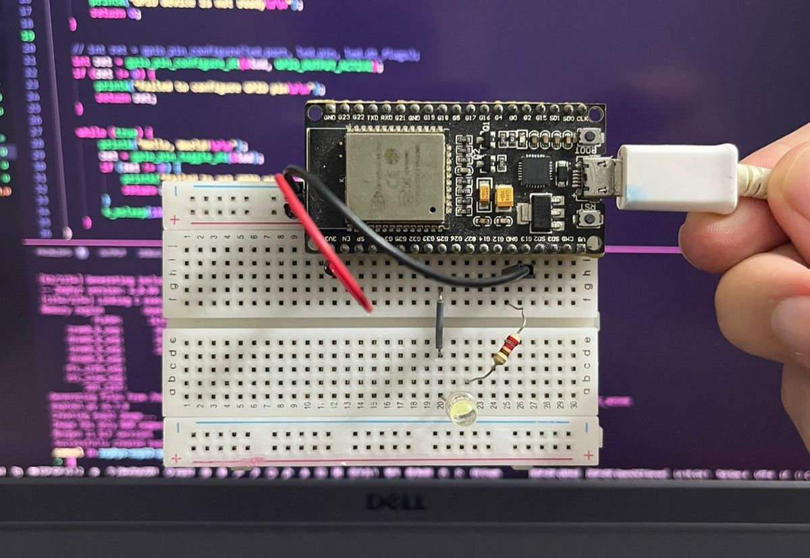

# Blink LED with ESP32 and Zephyr RTOS

This is a simple example of how to blink a LED using the ESP32 and Zephyr RTOS. The example is based on the [Blink LED example](https://docs.zephyrproject.org/latest/samples/basic/blinky/README.html) from Zephyr OS documentation.

## Prerequisites

- 1x LED
- 1x Resistor (220Ω)
- 1x ESP32 (WROOM, DevKitC, etc.)
- 1x Breadboard
- Jumper wires
- Zephyr SDK and west installed

<!-- Center the image -->
<!-- markdownlint-disable MD033 -->
<p align="center">
  
</p>
<!-- markdownlint-enable MD033 -->

## Project Structure

```plaintext
blink_led_pt2
├── boards
│   ├── esp32_devkitc_wroom.conf
│   └── esp32_devkitc_wroom.overlay
├── CMakeLists.txt
├── prj.conf
├── README.md
└── src
    └── main.c
```

- `boards/esp32_devkitc_wroom.conf`: Board-specific configuration file.
- `boards/esp32_devkitc_wroom.overlay`: Devicetree overlay file to configure hardware.
- `CMakeLists.txt`: CMake configuration file.
- `prj.conf`: General project configuration file.
- `src/main.c`: Source code for the LED blinking application.

## Devicetree Overlay

The `.overlay` file customizes the hardware configuration by modifying the *devicetree*. To configure the LED, include the following in the `boards/esp32_devkitc_wroom.overlay` file:

```dts
/ {
    leds {
       compatible = "gpio-leds"; // This is the driver that will be used to control the LED
       blinking_led: blinking_led {  // This is the name of the LED
           gpios = <&gpio0 25 GPIO_ACTIVE_HIGH>; // This is the GPIO pin that the LED is connected to
            label = "LED_0"; // This is the label that will be used to control the LED
        };
    };
};

```

This snippet adds an LED node (`blinking_led`) connected to GPIO 25.

---

To use `.overlay` and `.conf` files, the `CMakeLists.txt` file must be configured to specify these files explicitly. Without this configuration, the build system might not apply the customizations, leading to errors such as:

```bash
error: '__device_dts_ord_DT_N_NODELABEL_blinking_led_P_gpios_IDX_0_PH_ORD' undeclared here (not in a function)
# OR
error: 'DT_N_NODELABEL_blinking_led_P_gpios_IDX_0_VAL_pin' undeclared here (not in a function)
```

Add the following to `CMakeLists.txt`:

```cmake
# Directory for board configuration files
set(BOARD_DIR ${CMAKE_CURRENT_SOURCE_DIR}/boards)

# Devicetree Overlay configuration
set(DTC_OVERLAY_FILE ${BOARD_DIR}/esp32_devkitc_wroom.overlay)

# Additional configuration file
set(EXTRA_CONF_FILE ${BOARD_DIR}/esp32_devkitc_wroom.conf)
```

The name of the `.overlay` and `.conf` is of your choice. But it is recommended to use the board name for clarity. This configuration will appoint the build system to the correct files.

---

### Build and Flash

1. **Build the Project**  
   Use the following command to build the project for the ESP32 board:

   ```bash
   west build -b esp32_devkitc_wroom/esp32/appcpu -p always
   ```

2. **Flash the Firmware**  
   Flash the firmware to the board:

   ```bash
   west flash
   ```

3. **Monitor Serial Output**  
   Use the monitor command to view the serial output:

   ```bash
   west espressif monitor
   ```

If everything is configured correctly, the LED on the ESP32 should blink at 1-second intervals.

---

### Another way to configure the Devicetree Overlay

You can set the variables `DTC_OVERLAY_FILE` and `EXTRA_CONF_FILE` on the command line when building the project. This way, you don't need to modify the `CMakeLists.txt` file.

```bash
west build -b esp32_devkitc_wroom/esp32/procpu -p always -- -DDTC_OVERLAY_FILE=boards/esp32_devkitc_wroom.overlay -DEXTRA_CONF_FILE=boards/esp32_devkitc_wroom.conf
```

## References

- [Zephyr RTOS Documentation](https://docs.zephyrproject.org/latest/)
- [Getting Started Guide](https://docs.zephyrproject.org/latest/develop/getting_started/index.html)
- [Set devicetree overlays](https://docs.zephyrproject.org/latest/build/dts/howtos.html#set-devicetree-overlays)
- [Setting Kconfig configuration values - The Initial Configuration](https://docs.zephyrproject.org/latest/build/kconfig/setting.html#the-initial-configuration)
- [One Time CMake Arguments](https://docs.zephyrproject.org/latest/develop/west/build-flash-debug.html#one-time-cmake-arguments)
- [Blinky](https://docs.zephyrproject.org/latest/samples/basic/blinky/README.html#blinky)
- [[Legado] Zephyr RTOS no ESP32 – Primeiros Passos](https://embarcados.com.br/zephyr-rtos-no-esp32-primeiros-passos/)
- [[Legado] Blink LED no ESP32 e Zephyr RTOS](https://embarcados.com.br/blink-led-no-esp32-e-zephyr-rtos/)
