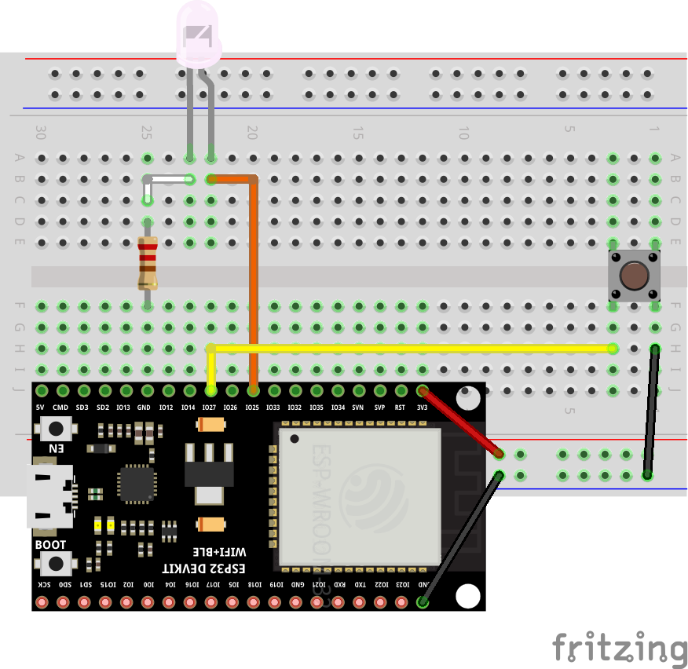

# Push button and LED with ESP32 and Zephyr RTOS

This is a simple example of how to blink a LED based on the state of a push button using the Zephyr RTOS on an ESP32 board. The LED will turn on when the button is pressed and turn off when it is released. This example is based on the video tutorial [Introduction to Zephyr Part 4: Devicetree Tutorial](https://youtu.be/fOMJyjwowNk?si=rymuxnaIRnDH1FK-).

## Prerequisites

- 1x LED
- 1x Resistor (220Ω)
- 1x Button
- 1x ESP32 (WROOM, DevKitC, etc.)
- 1x Breadboard
- Jumper wires
- `Zephyr SDK` and `west` installed

<!-- Center the image -->
<!-- markdownlint-disable MD033 -->
<p align="center">
  
</p>
<!-- markdownlint-enable MD033 -->

## Project Structure

```plaintext
button_polling
├── boards
│   ├── esp32_devkitc_wroom.conf
│   └── esp32_devkitc_wroom.overlay
├── CMakeLists.txt
├── prj.conf
├── README.md
└── src
    └── main.c
```

- `boards/esp32_devkitc_wroom.conf`: Board-specific configuration file.
- `boards/esp32_devkitc_wroom.overlay`: Devicetree overlay file to configure hardware.
- `CMakeLists.txt`: CMake configuration file.
- `prj.conf`: General project configuration file.
- `src/main.c`: Source code for the application.

## Devicetree Overlay

The `.overlay` file customizes the hardware configuration by modifying the *devicetree*. To configure the LED and push button, include the following in the `boards/esp32_devkitc_wroom.overlay` file:

```dts
/ {
    aliases {
        my-button = &push_button; // This is the alias for the button
        my-led = &blinking_led; // This is the alias for the LED
    };
    leds {
        compatible = "gpio-leds"; // This is the driver that will be used to control the LED
        blinking_led: d25 {  // Node name for the LED
            gpios = <&gpio0 25 GPIO_ACTIVE_HIGH>; // This is the GPIO pin that the LED is connected to
            label = "LED_0"; // This is the label that will be used to control the LED
            status = "okay";
        };
    };

    buttons {
        compatible = "gpio-keys"; // This is the driver that will be used to control the button
        polling-mode; // This enables pooling mode for the button

        push_button: d27 { // Node name for the button
            gpios = <&gpio0 27 (GPIO_ACTIVE_LOW | GPIO_PULL_UP)>; // This is the GPIO pin that the button is connected to
            label = "BUTTON_27";
            status = "okay";
        };
    };
};
```

This snippet adds an LED node (`blinking_led`) connected to GPIO 25 and a button node (`push_button`) connected to GPIO 27. The button is configured to use pull-up resistors and active-low logic.

---

To use `.overlay` and `.conf` files, the `CMakeLists.txt` file must be configured to specify these files explicitly. Without this configuration, the build system might not apply the customizations, leading to errors such as:

```bash
error: '__device_dts_ord_DT_N_NODELABEL_blinking_led_P_gpios_IDX_0_PH_ORD' undeclared here (not in a function)
# OR
error: 'DT_N_NODELABEL_blinking_led_P_gpios_IDX_0_VAL_pin' undeclared here (not in a function)
```

Add the following to `CMakeLists.txt`:

```cmake
# Directory for board configuration files
set(BOARD_DIR ${CMAKE_CURRENT_SOURCE_DIR}/boards)

# Devicetree Overlay configuration
set(DTC_OVERLAY_FILE ${BOARD_DIR}/esp32_devkitc_wroom.overlay)

# Additional configuration file
set(EXTRA_CONF_FILE ${BOARD_DIR}/esp32_devkitc_wroom.conf)
```

The name of the `.overlay` and `.conf` is of your choice. But it is recommended to use the board name for clarity. This configuration will appoint the build system to the correct files.

---

### Build and Flash

1. **Build the Project**  
   Use the following command to build the project for the ESP32 board:

   ```bash
   west build -b esp32_devkitc_wroom/esp32/procpu -p always
   ```

2. **Flash the Firmware**  
   Flash the firmware to the board:

   ```bash
   west flash
   ```

3. **Monitor Serial Output**  
   Use the monitor command to view the serial output:

   ```bash
   west espressif monitor
   ```

If everything is configured correctly, you should see the button state and LED state printed in the console. Pressing the button will turn on the LED, and releasing it will turn off the LED.

---

### Another way to configure the Devicetree Overlay

You can set the variables `DTC_OVERLAY_FILE` and `EXTRA_CONF_FILE` on the command line when building the project. This way, you don't need to modify the `CMakeLists.txt` file.

```bash
west build -b esp32_devkitc_wroom/esp32/procpu -p always -- -DDTC_OVERLAY_FILE=boards/esp32_devkitc_wroom.overlay -DEXTRA_CONF_FILE=boards/esp32_devkitc_wroom.conf
```

## References

- [Introduction to Zephyr Part 4: Devicetree Tutorial](https://youtu.be/fOMJyjwowNk?si=rymuxnaIRnDH1FK-)
- [Zephyr RTOS Documentation](https://docs.zephyrproject.org/latest/)
- [Getting Started Guide](https://docs.zephyrproject.org/latest/develop/getting_started/index.html)
- [Set devicetree overlays](https://docs.zephyrproject.org/latest/build/dts/howtos.html#set-devicetree-overlays)
- [Setting Kconfig configuration values - The Initial Configuration](https://docs.zephyrproject.org/latest/build/kconfig/setting.html#the-initial-configuration)
- [One Time CMake Arguments](https://docs.zephyrproject.org/latest/develop/west/build-flash-debug.html#one-time-cmake-arguments)
- [Button](https://docs.zephyrproject.org/latest/samples/basic/button/README.html)
- [[Legado] Zephyr RTOS no ESP32 – Primeiros Passos](https://embarcados.com.br/zephyr-rtos-no-esp32-primeiros-passos/)
- [[Legado] Blink LED no ESP32 e Zephyr RTOS](https://embarcados.com.br/blink-led-no-esp32-e-zephyr-rtos/)
